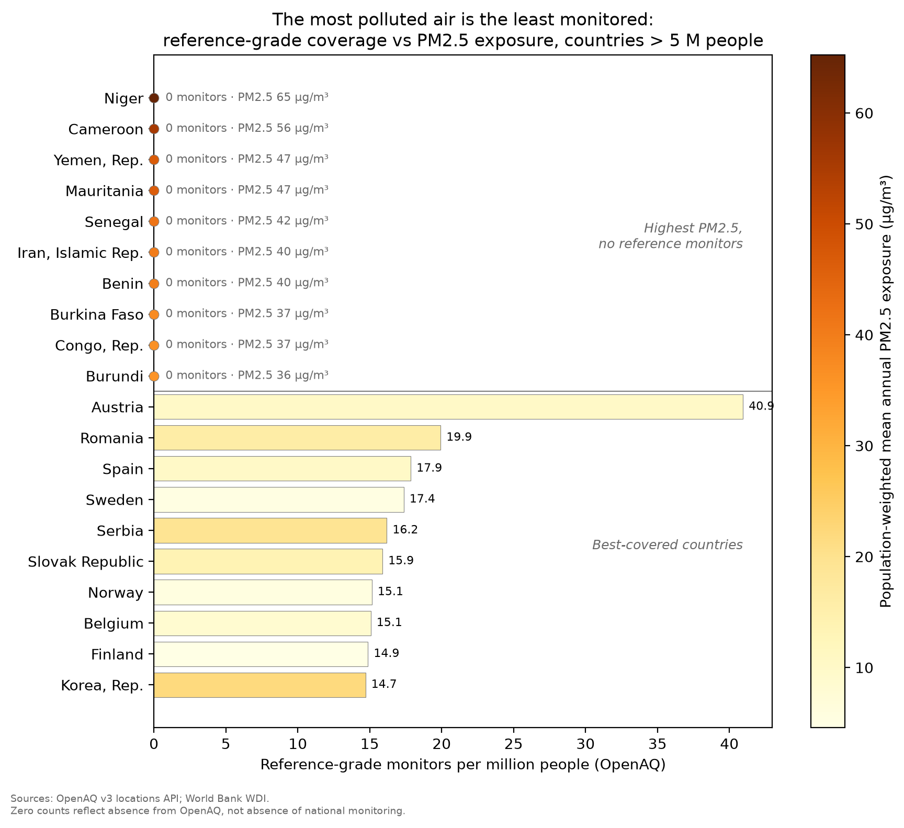

## Question 1 - data acquisition

Before this assessment, I had never used a public API or a scraper to obtain data; the closest I had come was using publicly available data from GitHub in a data challenge. So the following experience is something I prepared specifically for this assessment. I wanted to study how good OpenAQ's (an open platform established to reduce inequality in access to air-quality data) coverage of the world actually is, and whether the countries it omits are precisely the ones that need it most.

In the preparatory work of looking for a data source, I drew up a candidate list (Open-Meteo, ENTSO-E, OpenAQ, and several others), and tested each one against three questions. 1. Would the acquisition process involve the kinds of obstacles that real data can genuinely present (for example authentication, rate limits, pagination)? Could the data adequately support the argument I wanted to prove? Could the data provide a large enough volume for my later experiments? ENTSO-E's data is probably the richest, but its token takes three business days to be issued, and I judged that the days between now and the deadline did not leave much slack for trial and error. OpenAQ v3, on the other hand, met the conditions I had thought out in advance, and the data the platform provides is messy enough to let me run into those anticipated potential problems.

The fact, however, is that the difficulties I actually ran into were not entirely the ones I had imagined. The real data provided by OpenAQ v3 gave me no ability to query the corresponding information directly by city. Every call has to go through the locations → sensors → measurements path, and before an error message corrected me, I had already written half my code on the wrong assumption. The next problem was that the pagination metadata returns the literal string ">1000" when the total exceeds one thousand, so the number of pages cannot be worked out in advance; my way of handling it was to cap each page at 1000 entries and let the paging loop run until some page returned less than a full page of data. After twenty-six pages, I had 25,364 stations.

Throughout the whole process I was using an LLM for source-finding and debugging. Where I was able to verify things, it really was helpful; elsewhere it would hallucinate severely, outputting results that were not real. The deeper risk is that it always tries to make a project look as perfect as possible, while the data has not produced similar results. From then on it has been, for me, only a preliminary hint—I no longer use it for anything judgment-related.

*Appendix A: code at https://github.com/TongYu-T/math70076-a2*

*Word count: 443 words.*


## Question 2 - data wrangling, visualisation and communication


The figure below presents the core argument of the whole project: a platform built to examine air-quality inequality itself exhibits inequality on the question of coverage. Specifically, the countries with the highest PM2.5 exposure are precisely the countries that have no reference-grade monitors at all on this platform; while the best-covered countries are the ones listed as the cleanest.

I designed this figure for those without a statistics background: for example, a program officer at some funding agency or international organization who is deciding where the money for building monitoring stations should flow—this figure can very intuitively bring that reader a meaningful conclusion in very little time.

I once considered making a scatter plot of monitor density against PM2.5. That relationship does exist, but a scatter plot needs a log axis to be read clearly, and density spans four orders of magnitude, while zero cannot be plotted on a log axis. Yet the zeros are exactly what the point I want to make needs most: Cameroon has twenty stations, a PM2.5 of 55.6 µg/m³, and not a single reference-grade monitor.Something like log(x+1) might be able to solve the problem, but it potentially requires the reader to have a certain mathematical background in order to understand that kind of treatment. In the end I chose a two-panel bar chart: the upper group is the ten countries with the highest PM2.5 and the lowest number of reference-grade monitors (that is, the zero group), and the lower group is the ten best-covered ones. Bar length encodes the number of monitors per million people, and color represents the concentration of PM2.5. This figure can intuitively reflect the problem we mentioned in the previous question.

However, this choice is not perfect either—for example, a bar of zero length is invisible, and the color that was supposed to convey PM2.5 concentration information becomes far less conspicuous in exactly those countries that are crucial to our argument. I had no choice but to add corresponding text annotations to the colored dots at the origin (for example "0 monitors · PM2.5: 55 µg/m³"). The data-wrangling decisions follow the same audience logic. I kept only countries with a population over five million, so as to reduce as much as possible the anomalies that countries with too small a population might introduce; when PM2.5 concentrations are the same, countries are sorted using population as the tiebreaker, so that when exposure levels are comparable, the countries with more people affected come first.

If it were aimed at readers with some mathematical background, I would do no selecting at all and plot all 148 countries in a single distribution chart, with reference-station density on the horizontal axis and PM2.5 on the vertical axis, and the zero values listed on a separate baseline. That way readers could see for themselves where my twenty countries fall, and could also see the specific situation of that large middle mass of countries I did not mention. Because I think that although the figure I presented is concise and intuitive enough, some readers will inevitably question things like "why is the population baseline set at 5 million?" or "why only the worst ten and the best ten?"

{#fig-coverage width="90%"}

*Reproduction code in Appendix B.*

*Word count: 534 words.*



## Question 3 - function design and documentation

The function I want to examine is nearest_reference_km, which I designed. In this data, sensors are divided into low-cost sensors and reference-grade monitors, and the function computes, for each of the 8,212 low-cost sensors in the inventory, how far away its nearest reference-grade monitor (17,152 in total) is. The function takes the coordinates of these two different sets of sensors, and for each coordinate of the low-cost sensors compares it against the other set, computing the nearest distance. The answer shows a long tail. The median distance is 6.1 km, but the 90th percentile is 106 km, and the farthest is 2,078 km. Half of the sensor network could in principle rely on a neighboring reference-grade station for calibration, while the portion in the tail is left entirely on its own.

This function detects and returns errors—for example: empty arrays, NaN coordinates, mismatched shapes, and values outside the legal latitude or longitude range all raise ValueError, together with a message the caller can refer to, such as "ValueError: query: latitude out of [-90, 90] — did you swap lat/lon?"

This distance matrix has about 141 million elements, roughly 1.1 GB, not counting intermediate arrays. So the function's computation is done in chunks, with chunk_size set as an adjustable parameter. The docstring writes out the memory formula and states explicitly that this parameter affects speed and memory but not the result; the module also retains a second, deliberately naive implementation: a double loop over Python floats, several orders of magnitude slower, but able to guarantee stably correct output, so it can be used as a reference for the correct answer.

As for portability, porting this project takes only three steps: clone the repository, run pip install -e . in the project directory, then pytest. There is no API key to configure, no internet connection needed, and no manually installing libraries by following the README, because the dependencies are all written in pyproject.toml and get pulled in together at install time.

One point I am not entirely sure about is whether that slow implementation should be kept in a real project. It may never run in a production environment, and it is quite likely to be challenged as redundant. But the fast version reshapes array dimensions back and forth in the middle, and on its own there is no way to confirm that it computes correctly. The output of the naive double loop is the only result I can be sure is stably correct, so it stays as the benchmark against which the fast version is compared.
*Reproduction: Appendix C and the GitHub repository.*

*Word count: 427 words.*



## Question 4 - profiling code performance


I profiled `nearest_reference_km` from Question 3 in two ways: wall-clock comparison against the naive double-loop version the module deliberately keeps, and `line_profiler` on both implementations. The function has to find, for each of 8,212 low-cost sensors, the nearest of 17,152 reference-grade monitors — about 141 million distance calculations.

The naive version took 11.74 s on a 500-sensor subsample, which extrapolates to roughly 3.2 minutes for the full dataset. `line_profiler` pinned the cost down exactly: 93.8% of the time sat on the one line inside the inner loop that calls `haversine_km` — 857,600 calls, at about 1.9 µs each. `haversine_km` implements the haversine formula, which returns the great-circle distance between two points on a sphere from their latitudes and longitudes — a handful of trigonometric operations, no more.

The fix was to let the array shapes carry the loop: take a batch of query points and broadcast them against all reference points at once. Running the same profiler on the chunked version, the picture flips exactly — 99.1% of the time falls inside a single `haversine_km` call over a 2,000 × 17,152 block. Which is how a vectorised function should spend its time: on the arithmetic itself, not on arranging for the arithmetic to happen. Measured speedup: 63×. The subsample drops to 0.187 s, the full dataset to a few seconds.

Naive vectorisation, though, would build the full 141-million-entry matrix in one go — about 1.1 GB per intermediate array, and haversine needs several of them along the way — so chunking was non-negotiable. I had assumed chunk size simply traded memory for speed, bigger meaning faster. It doesn't. Sweeping different chunk sizes, 200 query points per block came out fastest (2.46 s, ~27 MB), while stuffing all 8,212 into a single block was slowest (4.97 s, ~1.1 GB) — twice the runtime of the best setting.This changed how I think about "performance". I had taken it for a monotonic curve — the more you give it, the faster it runs. What actually exists is a turning point between memory and speed, past which both get worse together. Which means "fastest" and "leanest" are not necessarily opposed; sometimes they turn out to be the same setting.

It's worth being honest about the stakes here. My function does fairly simple arithmetic, and the dataset isn't enormous — nothing in the hundreds of thousands — so whichever approach I take, it finishes in seconds either way. What the exercise gave me wasn't a runtime I needed. It was the reminder not to take my own assumptions for granted. The next time I hit genuinely large data or a genuinely expensive computation, I'll come at it with this experience already in hand, and that should save me a lot of trial and error.

*Supporting evidence in Appendix D.*

*Word count: 461 words.*


## Question 5 - project organisation, collaboration and reproducibility.

The project I am reflecting on is the OpenAQ coverage analysis behind Questions 1–4: a solo project, which shaped everything about how it had to be managed. There was no one to divide tasks with, but also no one to catch my mistakes, remember my decisions, or run my code on a second machine — so the management problem became building substitutes for an absent collaborator.

Defining the project was the first real decision. Before choosing a data source, I first set three criteria: the acquisition process had to have enough friction that I would learn something from it; the data had to support an argument; and the computation had to be large enough for later performance profiling. Once they were set, I went by them, including the part I was reluctant about: ENTSO-E was probably the better dataset, but its token takes three business days to issue, which might not make the deadline, so it had to be ruled out.

Writing the criteria first and only then looking seriously at the candidates was the single most useful management practice in the whole project. Afterwards, every time a thought about scope came up (another pollutant? a time dimension?), checking it against those three lines settled it, without rethinking from scratch each time.

The reproducibility infrastructure was mostly standard, and I chose it for a selfish reason that turned out to be the right one: the first beneficiary of reproducible work is you, three days later. The code lives in an installable package (pip install -e .) rather than behind sys.path hacks, so imports behave identically anywhere; dependencies are declared in `pyproject.toml`; the API key lives in .env, which .gitignore excludes; nbstripout keeps notebook outputs out of version control so diffs show changes to thinking rather than changes to rendering; and every API response is cached to disk. The cache was meant as politeness to a rate-limited API. It repaid itself the day my kernel died mid-analysis: the full pipeline re-ran without a network connection or a single repeated request. Similarly, the ten tests run offline with no credentials — a decision I made after realising that a test requiring my key is a test only I can run, which defeats its point. The one failure of this system was ordering: I decided where secrets live after pasting my API key into a chat window, and had to rotate it. Infrastructure decisions made reactively are made once and badly; the lesson is that "where do secrets live" belongs in the first hour of a project, next to git init.

There was one collaborator throughout: an LLM, and managing it turned out to be a genuine project-management problem rather than a tooling detail. It behaved like an extremely fast junior colleague with no accountability — excellent at generating candidate sources and debugging pagination, confidently wrong about API structure, and, more subtly, inclined to set direction. The correction was procedural, not technological: decisions moved to a written log with reasons attached (decisions.md in the repository), and anything the tool proposed had to be re-derived or verified before it counted. That log is now the backbone of this report's reflections, which is itself the lesson — in a solo project with an LLM, provenance of decisions needs managing as deliberately as provenance of data.

What I would do differently next time reduces to sequencing: secrets, caching and tests belong at the start, where they are cheap; and the audience for the final output — which I fixed embarrassingly late — belongs before the first figure, not after it.

*Supporting evidence in Appendix E.*

*Word count: 600 words.*


## Appendix A {.appendix}
The full acquisition pipeline is at <https://github.com/TongYu-T/math70076-a2>.
The components relevant to this question: `src/openaq_survey/client.py`
(authentication via `.env`, pagination until a short page, retry and
rate-limit handling, on-disk response caching), `src/openaq_survey/worldbank.py`
(indicator retrieval, aggregate filtering), and `notebooks/01_acquire.ipynb`
(the run that produced `data/`: 25,364 stations over 26 pages, 105,518
sensors, joined to World Bank denominators for 148 countries). To reproduce:
`pip install -e ".[dev]"`, place an OpenAQ key in `.env`, run the notebook;
cached responses make re-runs offline. The offline test suite
(`pytest tests/ -q`, no key required) covers the client and the distance
module.



## Appendix B {.appendix}

Reproduction code for @fig-coverage. `table` is the merged country-level table
built by the acquisition pipeline in Appendix A (OpenAQ station inventory joined
to World Bank population and PM2.5 exposure); the full pipeline is in the GitHub
repository.

```python
import matplotlib.pyplot as plt
import numpy as np

plot_df = table[(table["population"] > 5e6) & table["pm25"].notna()].copy()

# Ten highest-PM2.5 countries with zero reference-grade monitors;
# ties broken by population (more people affected first).
zero_ref = plot_df[plot_df["reference_per_million"] == 0]
worst = zero_ref.nlargest(10, ["pm25", "population"])
best  = plot_df.nlargest(10, "reference_per_million")
combined = pd.concat([worst, best])

labels  = combined["country_name"].tolist()
values  = combined["reference_per_million"].to_numpy()
colours = combined["pm25"].to_numpy()

fig, ax = plt.subplots(figsize=(9, 8))
y = np.arange(len(combined))
norm = plt.Normalize(colours.min(), colours.max())
cmap = plt.cm.YlOrBr

ax.barh(y, values, color=cmap(norm(colours)), edgecolor="grey",
        linewidth=0.4)
ax.set_yticks(y)
ax.set_yticklabels(labels)
ax.invert_yaxis()
ax.axhline(len(worst) - 0.5, color="grey", linewidth=0.8)

# Zero-length bars are invisible: mark them with a PM2.5-coloured dot
# and annotate the value so the colour encoding still carries
# information.
xmax = values.max()
for yi, v, c in zip(y, values, colours):
    if v == 0:
        ax.scatter(0, yi, s=45, color=cmap(norm(c)), edgecolor="grey",
                   linewidth=0.4, zorder=3, clip_on=False)
        ax.annotate(f"0 monitors · PM2.5 {c:.0f} µg/m³", (0, yi),
                    xytext=(8, 0), textcoords="offset points",
                    va="center", fontsize=8, color="dimgrey")
    else:
        ax.annotate(f"{v:.1f}", (v, yi), xytext=(4, 0),
                    textcoords="offset points", va="center",
                    fontsize=8)

ax.text(xmax, (len(worst) - 1) / 2,
        "Highest PM2.5,\nno reference monitors",
        ha="right", va="center", fontsize=9, style="italic",
        color="dimgrey")
ax.text(xmax, len(worst) + (len(best) - 1) / 2,
        "Best-covered countries",
        ha="right", va="center", fontsize=9, style="italic",
        color="dimgrey")

ax.set_xlabel("Reference-grade monitors per million people (OpenAQ)")
ax.set_title("The most polluted air is the least monitored:\n"
             "reference-grade coverage vs PM2.5 exposure, "
             "countries > 5 M people")

sm = plt.cm.ScalarMappable(cmap=cmap, norm=norm)
cbar = fig.colorbar(sm, ax=ax)
cbar.set_label(
    "Population-weighted mean annual PM2.5 exposure (µg/m³, modelled)")

fig.text(0.01, 0.02,
         "Sources: OpenAQ v3 locations API; World Bank WDI.\n"
         "Zero counts reflect absence from OpenAQ, "
         "not absence of national monitoring.",
         fontsize=7, color="dimgrey")

fig.tight_layout(rect=[0, 0.05, 1, 1])
fig.savefig("figures/coverage.png", dpi=200, bbox_inches="tight")
```



## Appendix C {.appendix}

The distance module from src/openaq_survey/distance.py (docstrings abridged for space; full version with the naive oracle implementation in the GitHub repository), followed by an excerpt from its offline test suite.

```python
EARTH_RADIUS_KM = 6371.0088  # mean Earth radius, IUGG value


def haversine_km(lat1, lon1, lat2, lon2):
    """Great-circle distance in km. Decimal degrees in; broadcasts.

    >>> round(haversine_km(51.5074, -0.1278, 48.8575, 2.3514), 1)  # London-Paris
    343.9
    """
    lat1, lon1, lat2, lon2 = map(np.radians, (lat1, lon1, lat2, lon2))
    dlat = lat2 - lat1
    dlon = lon2 - lon1
    a = np.sin(dlat / 2) ** 2 + np.cos(lat1) * np.cos(lat2) * np.sin(dlon / 2) ** 2
    return 2 * EARTH_RADIUS_KM * np.arcsin(np.sqrt(a))


def nearest_reference_km(query_lat, query_lon, ref_lat, ref_lon, chunk_size=2000):
    """Distance from each query point to its nearest reference point, in km.

    Chunked so the ~8,000 x ~17,000 pairwise matrix never materialises:
    peak memory is chunk_size * n_ref * 8 bytes per intermediate array.
    `chunk_size` affects speed and memory only, never the result.

    Raises ValueError on empty, non-finite, or out-of-range coordinates.
    """
    query_lat = np.asarray(query_lat, dtype=float).ravel()
    query_lon = np.asarray(query_lon, dtype=float).ravel()
    ref_lat = np.asarray(ref_lat, dtype=float).ravel()
    ref_lon = np.asarray(ref_lon, dtype=float).ravel()
    _validate_coords(query_lat, query_lon, "query")
    _validate_coords(ref_lat, ref_lon, "reference")

    out = np.empty(query_lat.size, dtype=float)
    for start in range(0, query_lat.size, chunk_size):
        stop = start + chunk_size
        block = haversine_km(
            query_lat[start:stop, None], query_lon[start:stop, None],
            ref_lat[None, :], ref_lon[None, :],
        )
        out[start:stop] = block.min(axis=1)
    return out
    
def test_chunked_matches_naive_oracle():
    rng = np.random.default_rng(42)
    qlat, qlon = rng.uniform(-90, 90, 40), rng.uniform(-180, 180, 40)
    rlat, rlon = rng.uniform(-90, 90, 60), rng.uniform(-180, 180, 60)
    fast = nearest_reference_km(qlat, qlon, rlat, rlon, chunk_size=7)
    slow = nearest_reference_km_naive(qlat, qlon, rlat, rlon)
    np.testing.assert_allclose(fast, slow, rtol=1e-12)


def test_swapped_latlon_raises():
    # A longitude passed as latitude (e.g. 139.7 for Tokyo) must fail loudly.
    with pytest.raises(ValueError, match="swapped"):
        nearest_reference_km([139.7], [35.7], [61.0], [24.0])

```



## Appendix D {.appendix}

Timing comparison, 500-sensor subsample against all 17,152 reference monitors
(Apple Silicon laptop, Python 3.11, NumPy from the project lockfile):

```
naive : 11.74 s / 500 queries  -> est. full dataset 3.2 min
fast  : 0.187 s / 500 queries
speedup: 63x
```

`line_profiler` on the naive implementation (50-query subsample; bookkeeping
lines omitted). 93.8% of runtime is the scalar `haversine_km` call on line 150:

```
Line #      Hits         Time  Per Hit   % Time  Line Contents
==============================================================
   147        51       8000.0    156.9      0.0  for i in range(query_lat.size):
   148        50     387000.0   7740.0      0.0      best = np.inf
   149    857650   47080000.0     54.9      2.7      for j in range(ref_lat.size):
   150    857600 1643014000.0   1915.8     93.8          d = haversine_km(query_lat[i], ...)
   151    857600   61311000.0     71.5      3.5          if d < best:
   152       843      42000.0     49.8      0.0              best = d
```

The chunked implementation shows the inverse profile — 99.1% of time in a
single vectorised call, 0.8% in the row-wise minimum:

```
Line #      Hits         Time  Per Hit   % Time  Line Contents
==============================================================
   122         2  273109000.0 1.37e+08     99.1  block = haversine_km(
   128         1    2253000.0 2.25e+06      0.8  out[start:stop] = block.min(axis=1)
```

Chunk-size sweep, full dataset (8,212 queries). Throughput does not increase
monotonically with chunk size — the best setting uses 2% of the memory of the
worst and is twice as fast:

```
chunk_size    50: 2.85 s   (intermediate ~7 MB)
chunk_size   200: 2.46 s   (intermediate ~27 MB)
chunk_size  1000: 2.72 s   (intermediate ~137 MB)
chunk_size  4000: 4.42 s   (intermediate ~549 MB)
chunk_size  8212: 4.97 s   (intermediate ~1,127 MB)
```



## Appendix E {.appendix}
Repository layout (generated with `find`, caches excluded):

```
math70076-a2/
├── README.md
├── decisions.md
├── pyproject.toml
├── assessment-2-06051218.qmd
├── data/
│   ├── raw_locations.json
│   ├── stations.csv
│   ├── sensors.csv
│   ├── by_country.csv
│   └── country_table.csv
├── figures/
│   └── coverage.png
├── notebooks/
│   └── 01_acquire.ipynb
├── src/
│   └── openaq_survey/
│       ├── __init__.py
│       ├── client.py
│       ├── worldbank.py
│       ├── combine.py
│       └── distance.py
└── tests/
    ├── test_client.py
    └── test_distance.py
```

Packaging and declared dependencies, `pyproject.toml` (excerpt):

```toml
[project]
name = "openaq-survey"
requires-python = ">=3.10"
dependencies = [
    "requests>=2.31",
    "pandas>=2.0",
    "matplotlib>=3.7",
]

[project.optional-dependencies]
dev = ["pytest>=8.0", "jupyterlab", "ipykernel", "nbstripout"]

```

Secrets and caches kept out of version control, `.gitignore` (excerpt):

```
.env
*.key
.venv/
data/cache/
data/raw_locations.json
__pycache__/
```

Decision log (`decisions.md`, excerpt — full version in the repository):

```
| 3  | ENTSO-E rejected despite richer data.  | 3-day token vs deadline.    |
| 6  | API key moved to .env, key rotated.    | Key pasted into an AI chat. |
| 10 | Tests run offline, no credentials.     | Author-only test ≠ a check. |
| 19 | "Larger chunks faster" corrected.      | Falsified by profiling.     |
```

Commit history (`git log --oneline`, most recent first):

```
b64ec5a Track derived CSVs; raw JSON regenerable via client, not tracked
4a28f82 Rename report to CID filename
0360557 Report draft: Q1-Q5 responses and appendices
55b3f09 Add World Bank client and country-level combine logic
7217df1 Coverage figure: zero-bar annotations, shortened source note
3b88dbc Add nearest-reference distance module with offline tests
34acd61 Fill decision log dates
ac1c50e Ignore __pycache__
28fe031 Add decision log and AI acknowledgements
d23c45b Scaffold: package layout, OpenAQ client, offline tests
```

Offline test suite, no credentials required (`pytest tests/ -q`):

```
17 passed in 0.65s
```


